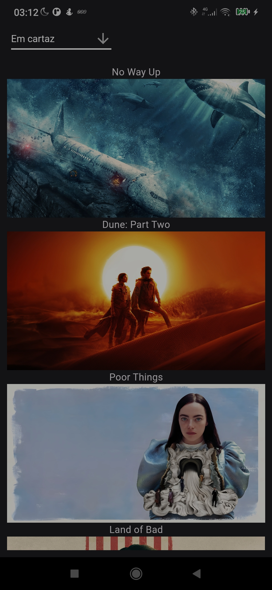
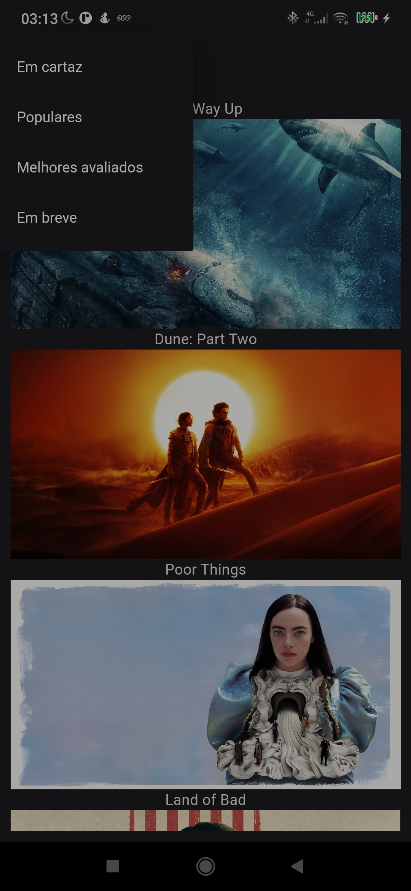

# flutter intro

A new Flutter project.

preview:

## Getting Started

This project is a starting point for a Flutter application.

A few resources to get you started if this is your first Flutter project:

- [Lab: Write your first Flutter app](https://docs.flutter.dev/get-started/codelab)
- [Cookbook: Useful Flutter samples](https://docs.flutter.dev/cookbook)

For help getting started with Flutter development, view the
[online documentation](https://docs.flutter.dev/), which offers tutorials,
samples, guidance on mobile development, and a full API reference.

## Requisitos

Para rodar o projeto devemos ter flutter instalado e um registro no [The Movie DB ](https://www.themoviedb.org/)

=======

## Objetivo

Utilizando a The Movie DB API produza um aplicativo mobile que liste e traga as informações dos filmes que estão em cartaz no cinema, seguindo o design passado.

## Informações

Você pode criar uma conta no The Movie DB ou utilizar o seguinte token de API:

4fbdbdb7ab0a64a4ff94f65a19d7693a  

Você deve seguir este design na criação do aplicativo, com as seguintes observações:
https://www.uplabs.com/posts/movies-e0f9c1ea-a644-4666-857b-10933c4089ca

As informações dos atores não é fornecida pela API, nesse caso pode ser ignorada
Na página principal, você deve ter as seguintes categorias:

Em cartaz (/movie/now_playing)
Populares (/movie/popular)
Melhores avaliados (/movie/top_rated)
Em breve (/movie/upcoming)   

## Detalhes técnicos

Você pode utilizar qualquer stack de desenvolvimento mobile, analisaremos a qualidade do código enviado, assim como arquitetura, organização e concordância com os requisitos pedidos.
O código deverá estar em um repositório público no GitHub, com um Readme explicando como rodar o projeto e com screenshots do resultado final.

Qualquer dúvida você pode nos procurar,
Boa sorte!

=====

## DEV

### API

https://www.themoviedb.org/settings/api

### 

https://developer.themoviedb.org/reference/movie-lists

### LIB

https://github.com/RatakondalaArun/tmdb_api

### Visual UI

https://www.uplabs.com/posts/movies-e0f9c1ea-a644-4666-857b-10933c4089ca

https://www.youtube.com/watch?v=s8hxGwF6pvE

https://www.youtube.com/watch?v=ll8B8OnqVp4
